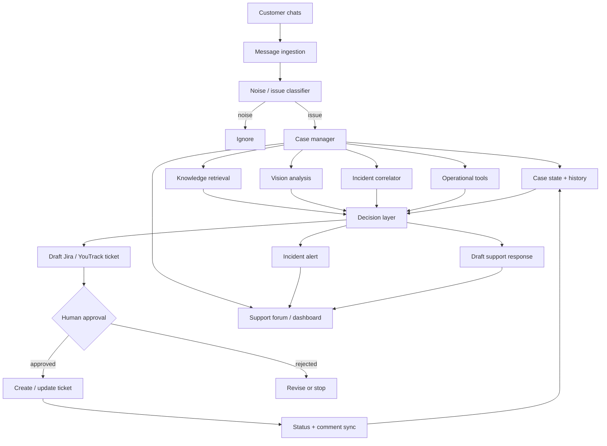

# AI Support Agent — Production Case Study

> A sanitized architecture case study of a production AI support operations system.

This repository describes how I designed and shipped a **stateful, tool-using AI agent for technical support operations**.

The production system monitors roughly **100 customer chats** and is currently used by **5 internal team members**. It started as a personal workflow tool and evolved into an operational system used by colleagues.

The source code, internal endpoints, credentials, company-specific prompts, customer data, and proprietary implementation details are intentionally not published here.

## What the system does

The agent continuously observes customer conversations and turns unstructured support traffic into structured operational work.

It can:

- detect real technical issues while ignoring noise, greetings, and unrelated conversation;
- classify the issue and create a structured case;
- attach follow-up messages and media to an existing case instead of creating duplicates;
- search a knowledge base and draft a response for simpler issues;
- analyze screenshots and other visual evidence;
- correlate semantically similar complaints across different customers;
- detect a possible mass incident when several independent reports appear in a short time window;
- draft Jira / YouTrack work items and keep their status synchronized with support workflows;
- inspect operational logs and read-only analytics data through tools;
- maintain support queues, digests, case history, and response-time statistics;
- require explicit human approval before high-impact actions.

The important part is that the system is not just a chatbot.

**It observes → classifies → retrieves context → uses tools → tracks state → escalates → reports back.**

## Production footprint

| Area | Current production use |
|---|---|
| Customer conversations | ~100 monitored chats |
| Internal users | 5 |
| Primary interface | Telegram |
| Issue tracking | Jira + YouTrack |
| Knowledge retrieval | Google Docs / Drive |
| Operational diagnostics | Cloud logs + read-only analytics |
| Deployment | Docker Compose |
| Application stack | Python 3.11, aiogram, FastAPI, SQLite |

## Companion runnable demo

This case study describes the production architecture at a sanitized level. A separate public repository reimplements the same operational patterns with synthetic data and can be run locally:

**[AI Support Triage — Runnable Demo](https://github.com/damos17/ai-support-triage-demo)**

The demo includes incident correlation, persistent case state, audit trail, evaluation metrics, telemetry, bilingual EN/RU UI, XSS escaping checks, and human-in-the-loop ticket approval. It exists so the architecture described here can be evaluated without access to production code, customer conversations, credentials, or internal infrastructure.

## High-level architecture



For a deeper breakdown, see [Architecture](docs/architecture.md).

## Core engineering ideas

### 1. Stateful support workflows

A support issue is treated as a **long-lived case**, not a single LLM request.

The system stores case metadata, related messages, customer context, status, external ticket links, and follow-up activity. When a customer sends more context later — for example a screenshot — the system attempts to attach it to the correct open case.

### 2. Cheap-first model routing

Not every message deserves an expensive model call.

The production design separates lightweight classification / matching from stronger reasoning tasks. This keeps latency and cost under control while reserving stronger models for tasks such as knowledge synthesis, diagnostics, instructions, and complex analysis.

### 3. Tool use instead of answer-only AI

The agent can work with external systems rather than only generating text. Tool boundaries include:

- knowledge retrieval;
- ticket management;
- cloud log inspection;
- read-only analytics queries;
- client / source lookup;
- report generation;
- operational support actions.

The LLM is therefore one component inside a controlled workflow, not the workflow itself.

### 4. Human-in-the-loop for consequential actions

Potentially consequential actions do not run merely because the model suggested them.

For example, an issue-tracker ticket is first prepared as a structured draft and shown to a human. Creation happens only after explicit approval.

More detail: [Human-in-the-loop design](docs/human-in-the-loop.md).

### 5. Semantic incident correlation

Customers rarely describe the same outage in the same words.

The system correlates reports by meaning rather than exact text. Multiple similar reports from independent customer chats inside a short time window can be promoted into a possible shared incident.

More detail: [Incident detection](docs/incident-detection.md).

## Technology

**Application**

`Python 3.11` · `aiogram 3` · `FastAPI` · `SQLite / aiosqlite` · `Docker Compose`

**AI**

`LLM APIs` · `tool calling` · `structured outputs` · `semantic matching` · `Vision AI` · `knowledge retrieval`

**Integrations**

`Telegram Bot API` · `Jira REST` · `YouTrack REST` · `Google Drive / Docs API` · `cloud logging` · `read-only analytics`

**Data / reporting**

`SQL` · `pandas` · `openpyxl` · `PDF / XLSX generation`

## Example case lifecycle

```text
Customer message
      ↓
Is this a real support issue?
      ↓ yes
Match to an existing open case?
      ↓
Create or update case
      ↓
Retrieve customer + technical context
      ↓
Search knowledge base / inspect evidence / use tools
      ↓
Simple issue? ── yes ──> Draft answer
      │
      no
      ↓
Draft escalation
      ↓
Human review / approval
      ↓
Create Jira or YouTrack item
      ↓
Track status and comments
      ↓
Return updates to the support workflow
```

A synthetic example of the data shape is available in [`examples/case.json`](examples/case.json).

## Design constraints

This system operates inside real support workflows, so reliability matters more than making the agent look autonomous.

Key constraints:

- no hidden destructive actions;
- explicit approval gates for important writes;
- read-only access where write access is unnecessary;
- persistent state across deployments;
- customer context kept separate from LLM reasoning;
- fallback behavior when an external integration is unavailable;
- operational logs and debuggable workflow state;
- gradual migration away from historical monolithic code rather than a risky full rewrite.

## What I learned building it

The largest lesson was that production AI automation is mostly a **systems problem**.

Model quality matters, but so do routing, state, retries, permissions, observability, fallback paths, data boundaries, UX, and the ability for a human to understand why the system is about to take an action.

The project also reinforced a practical rule I use in AI automation:

> Give the model enough freedom to reason, but keep the system — not the model — responsible for permissions, state, and irreversible actions.

## Repository scope

This repository contains architecture notes and synthetic examples only.

It does **not** contain:

- production source code;
- proprietary prompts;
- company or customer identifiers;
- credentials or API keys;
- internal URLs / IP addresses;
- production database schemas or dumps;
- private logs or support messages.

## Related public demo

The companion open-source project is already available:

**[AI Support Triage — Runnable Demo](https://github.com/damos17/ai-support-triage-demo)**

It demonstrates the same core patterns — triage, case state, incident correlation, auditability, evaluation, and explicit approval — using only synthetic data.

---

Built by [Daniil / @damos17](https://github.com/damos17) — AI Automation & Agentic Systems Builder.
