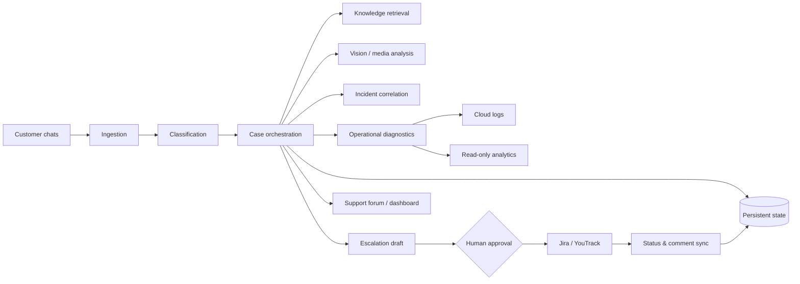

# Architecture

This document describes the **public, sanitized architecture** of the production AI support operations system.

It intentionally omits internal endpoints, credentials, company-specific identifiers, proprietary prompts, and production database details.

## System responsibilities

The system sits between customer communication channels and internal operational tooling.

Its core responsibility is to transform unstructured support traffic into a controlled workflow with persistent state.



## 1. Ingestion layer

Telegram is the main communication surface.

The ingestion layer receives messages and media from customer chats and preserves enough metadata to understand:

- where the message came from;
- which customer it belongs to;
- who sent it;
- whether it extends an existing issue;
- whether media belongs to an active case.

The system is designed around asynchronous message processing because external calls — LLM APIs, issue trackers, knowledge retrieval, logs, analytics — may all have different latency characteristics.

## 2. Classification and routing

Incoming messages are not immediately sent to the strongest available model.

The pipeline first determines whether the message is likely to be operationally relevant. Lightweight classification and heuristics handle common cases such as:

- greetings and thanks;
- internal employee replies;
- unrelated discussion;
- customer questions that should become a support case;
- follow-up context for an already open case.

This cheap-first routing reduces cost and unnecessary latency.

## 3. Case orchestration

A case is the central stateful object in the workflow.

A simplified public case model includes:

```text
case_id
customer_id
customer_context
category
title
description
status
messages[]
attachments[]
external_ticket_links[]
created_at
updated_at
```

The production implementation stores additional operational metadata, but those details are intentionally omitted here.

A case can survive multiple customer messages, multiple support interactions, escalation into an issue tracker, and later status updates from development.

## 4. Knowledge retrieval

For simpler issues, the system can search a knowledge base built from internal documentation.

The workflow is not just "retrieve text and paste it". Retrieved context is used as evidence for generating a problem-specific support response or instruction.

A typical flow:

```text
Issue
  ↓
Query formulation
  ↓
Knowledge retrieval
  ↓
Relevant sections
  ↓
Answer synthesis
  ↓
Human-visible draft
```

The production knowledge source uses Google Docs / Drive APIs. A local fallback is available for resilience.

## 5. Multimodal evidence

Support issues often arrive with screenshots or other media.

The system can include visual evidence in the reasoning flow so that the support operator does not need to manually restate everything visible in a screenshot.

Visual analysis is treated as supporting context, not unquestionable ground truth. Human review remains available before escalation.

## 6. Operational diagnostics

The system can call bounded diagnostic tools instead of asking the LLM to invent an answer.

Examples include:

- reading cloud logs;
- checking source / connector state;
- querying read-only analytics;
- retrieving customer-specific operational context;
- generating structured reports.

This separation is important: the model decides **what information it needs**, while deterministic integration code decides **how that information is accessed**.

## 7. Issue tracker orchestration

Escalation to development is a structured workflow.

The system prepares a draft containing the problem summary, customer context, observed evidence, checks already performed, and the requested engineering action.

Creation in Jira / YouTrack is gated by explicit human confirmation.

After creation, a background synchronization loop can track status and comments so support does not need to manually poll the issue tracker.

## 8. Incident correlation

A single support report is a case.

Several semantically similar reports from independent customers within a short window may be a shared incident.

The incident layer compares recent issue meaning rather than relying only on exact keywords. This is described separately in [incident-detection.md](incident-detection.md).

## 9. Persistence

The production system persists operational state so deployments and restarts do not destroy workflow context.

State includes case history, issue-tracker mappings, support queues, agent session data, and aggregated service metrics.

The public case study intentionally avoids publishing the real database schema.

## 10. Dashboard and operator UX

The system exposes both conversational and dashboard-like interaction patterns.

Examples include:

- active case digests;
- unanswered-chat queues;
- case lookup;
- incident alerts;
- issue tracker summaries;
- support statistics;
- operator-triggered diagnostics.

This matters because an AI agent is only useful operationally if humans can understand the current state and intervene when necessary.

## 11. Deployment and evolution

The production deployment uses Docker Compose.

The codebase also illustrates a practical production constraint: mature internal tools often evolve from an early monolith into progressively separated modules.

Rather than rewriting the whole system at once, functionality has been extracted into domain modules while preserving working behavior. This reduces migration risk.

## Architectural principle

The central design rule is:

> The LLM can reason about the workflow, but permissions, persistence, integrations, validation, and irreversible actions remain responsibilities of the surrounding system.
