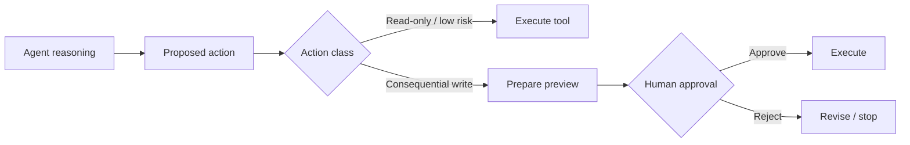

# Human-in-the-loop Design

The production system is intentionally **not** designed around maximum autonomy.

It is designed around useful autonomy inside explicit operational boundaries.

## Principle

The model may recommend an action, prepare an action, or gather context for an action.

The surrounding system decides whether that action is permitted and whether human approval is required.

## Why this matters

LLMs can be useful at:

- summarizing messy context;
- deciding which tool may help;
- drafting structured content;
- matching a new message to an existing issue;
- generating a proposed escalation;
- explaining diagnostic results.

They should not automatically gain authority over every connected system simply because they can reason about it.

## Example: issue tracker creation

A typical escalation flow looks like this:

1. The agent gathers the support conversation and relevant customer context.
2. It retrieves diagnostic evidence where available.
3. It prepares a structured issue-tracker draft.
4. The human sees the proposed title, description, evidence, and target workflow.
5. Only explicit approval causes the real ticket to be created.
6. The created ticket is linked back to the support case for later synchronization.

This preserves speed while keeping responsibility visible.

## Permission boundaries

The system distinguishes between different classes of tools.

### Read-oriented tools

Examples:

- search the knowledge base;
- inspect cloud logs;
- execute approved read-only analytical queries;
- retrieve ticket status;
- load customer / source metadata.

These can often be used automatically because they do not change external state.

### Write-oriented tools

Examples:

- create or modify development tickets;
- change operational configuration;
- execute actions that affect a customer environment.

These receive stricter validation, role checks, or explicit approval gates.

## RBAC and operator scope

Not every internal user needs the same level of control.

The production system separates ordinary support workflows from administrative or potentially destructive operations. This keeps the AI interface useful for more people without granting every user the same authority.

## Failure behavior

Human-in-the-loop is not just a confirmation button. The surrounding workflow also needs to handle:

- expired or stale drafts;
- an external API failing after approval;
- duplicated approval attempts;
- missing required fields;
- a case changing while a draft is awaiting review;
- permissions changing between reasoning and execution.

The deterministic application layer remains responsible for validating the final action at execution time.

## Design rule

> Never treat a model-generated intention as equivalent to an authorized system action.

That separation makes the agent more trustworthy in real operational work and allows stronger reasoning models to be used without giving them unrestricted authority.
