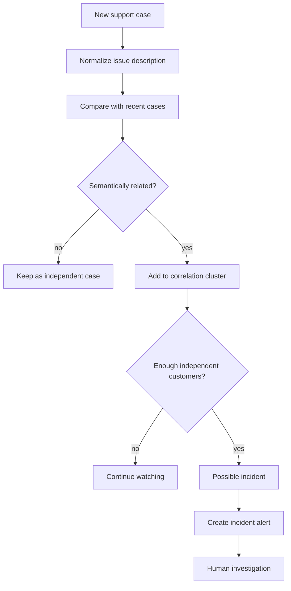

# Semantic Incident Detection

Support incidents rarely arrive as identical messages.

One customer may say:

> “New reviews stopped appearing.”

Another may report:

> “Nothing has been collected from the marketplace since this morning.”

A third may ask:

> “Is the connector down? We have no fresh data.”

Keyword matching can miss the relationship between these reports. The production system therefore treats incident detection as a **semantic correlation problem**.

## Goal

The goal is not to prove that an outage exists automatically.

The goal is to detect an emerging pattern early enough that a human operator can investigate it as one shared incident instead of several unrelated tickets.

## Simplified flow



## Correlation signals

The real system can combine several signals:

- semantic similarity of issue descriptions;
- issue category;
- affected subsystem or source;
- timing;
- whether reports come from independent customers;
- supporting diagnostics or logs.

Exact production thresholds and internal scoring details are intentionally omitted from this public repository.

## Why independent customers matter

Several messages from one customer may simply be follow-up context for the same issue.

An incident becomes more interesting when **different customers** report meaningfully similar symptoms within a short interval.

That distinction prevents one noisy conversation from looking like a platform-wide outage.

## What happens after detection

The incident detector does not silently perform destructive remediation.

Instead, it produces an operator-facing alert with a compact summary such as:

```text
Possible shared incident

Symptoms:
- fresh data not appearing
- several independent customers affected
- reports started within the same recent window

Suggested checks:
- connector health
- recent error patterns
- authentication failures
- rate limiting
- upstream provider status
```

The operator can then use diagnostic tools, logs, and issue trackers to confirm or reject the hypothesis.

## Design trade-off

Incident detection has asymmetric failure costs:

- **too sensitive** → alert fatigue;
- **too conservative** → slower outage recognition.

For that reason the system treats semantic correlation as a decision-support layer, not an unquestionable source of truth.

## Public demo plan

The open-source demo that follows this case study will reproduce the same pattern using synthetic cases and a configurable time window:

```text
recent cases
    +
semantic similarity
    +
independent customer count
    ↓
possible incident
```

That demo will be intentionally decoupled from all production systems and company data.
